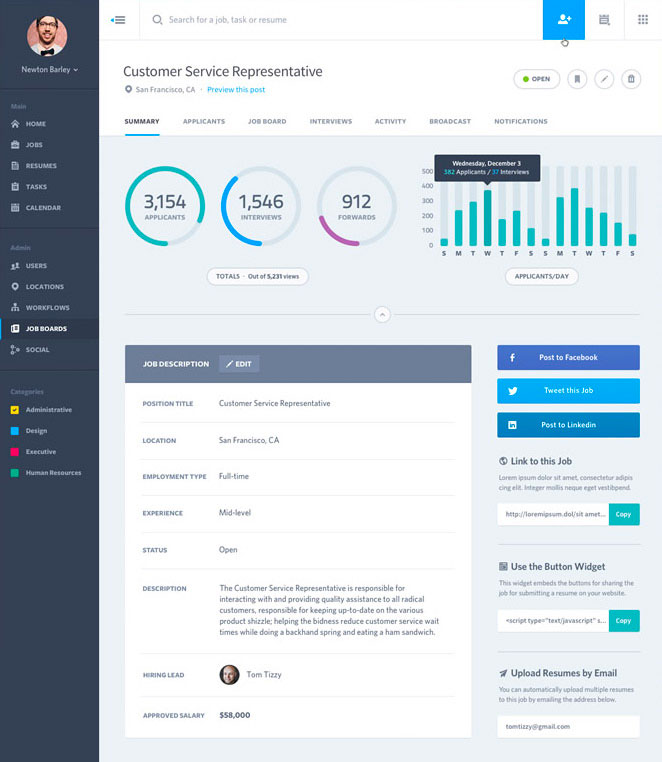
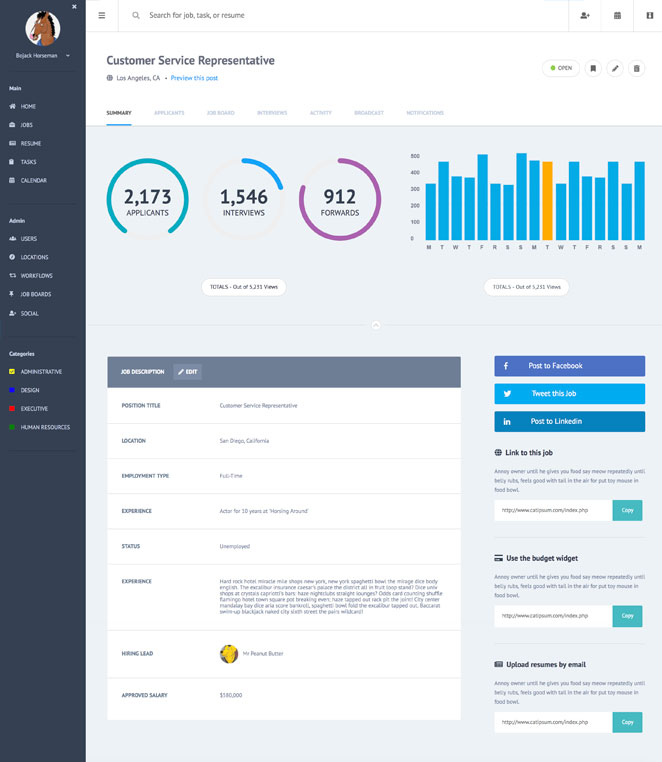

# tm-comp-challenge-3

Static Comp Challenge #3

I decided because this static comp was so complex to just stick with the theme that was given to us so I could focus on the design and responsiveness. The most difficut part for me was creating a mobile layout that was drastically different than the desktop version which involved adding additional HTML that was hidden on the desktop view. I also added just a little JS to get the menu to work. 

